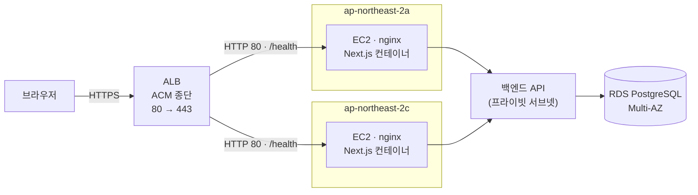
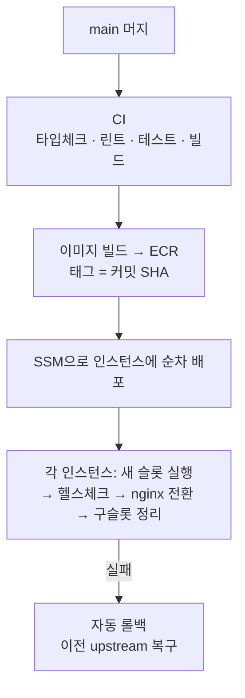

# BidFriend Frontend

나라장터 공공입찰 공고를 **회사 자격조건 기준으로 판정해** 보여주는 서비스의 Next.js
프론트엔드입니다. 수집·판정·추천 계산은 백엔드(`bidmate-backend`)가 담당하고, 이
레포는 화면과 백엔드 프록시만 담당합니다.

---

## 1. 제품 (기획 관점)

### 해결하는 문제

공공입찰 담당자는 하루 수백 건의 공고 중 **우리 회사가 참여할 수 있는 공고**를 골라야
합니다. 나라장터는 공고를 나열해줄 뿐 자격 판정을 해주지 않아, 담당자가 면허·지역·
실적·인증을 공고마다 직접 대조합니다.

BidFriend는 회사 프로필을 한 번 등록하면 공고별 **적합 판정과 그 근거**를 먼저 보여줍니다.
목표는 정보 제공이 아니라 **참여 여부 판단 속도**입니다.

### 판정 모델

백엔드가 공고마다 10개 축을 평가하고, 화면은 그 결과를 표시만 합니다(프론트에서 판정을
다시 계산하거나 추론하지 않습니다).

| 구분 | 축 | 미충족 시 |
|---|---|---|
| gate (필수) | 면허, 지역, 기업규모, 품목 | 하나라도 미충족이면 **불가** |
| supp (부가) | 직접생산, 인력, 실적, 시공능력, 인증, 신용 | **보완가능** |

최종 판정은 네 가지입니다.

| 판정 | 의미 |
|---|---|
| 가능 | 자격 충족 |
| 보완가능 | 필수는 통과, 부가조건이 빔 |
| 확인필요 | 공고에서 조건을 추출하지 못함 (미달이 아니라 미상) |
| 불가 | 자격 미달 — 목록에서는 기본 제외 |

"확인필요"를 "불가"와 구분하는 것이 핵심입니다. 데이터가 없다는 사실을 미달로 표시하면
담당자가 참여 가능한 공고를 놓칩니다.

### 화면

| 화면 | 경로 | 역할 |
|---|---|---|
| 홈 | `/` | 최근 공고 + 맞춤 추천 진입 |
| 맞춤 추천 | `/recommend` | 회사 조건 기준 자격 판정 목록 |
| AI 추천 | `/ai-recommend` | 참여 가능한 공고 중 관심사 유사도 순 |
| 공고 검색 | `/search` | 공고명·발주기관 검색, 마감·등록순 정렬 |
| 공고 상세 | `/bids/[bid_id]` | 축별 적합도 표 + 공고 원문 정보 |
| 비드봇 | `/bidbot` | 공고 내용·자격요건·마감 일정 자연어 질의 |
| 공고 통계 | `/stats` | 업종별 시장 규모 추이 |
| 마이페이지 | `/mypage` | 회사 프로필, 스크랩 |
| 이용안내 | `/guide` | 수집·판정 방식 설명, FAQ |

미완성 기능은 `src/lib/features.ts`의 환경변수 스위치로 감춥니다. **값이 없으면 꺼집니다** —
배포 설정에 깜빡 넣지 않아도 미완성 기능이 노출되지 않습니다. 비드봇은 백엔드 에이전트가
완성될 때까지 기본 비활성입니다.

---

## 2. 개발 (개발자 관점)

### 스택

Next.js 16 App Router · React 19 · TypeScript · Tailwind CSS 4 · AWS Cognito · Sentry

상태관리 라이브러리는 쓰지 않습니다. `useState`로 부족해지는 지점이 오면 그때 도입합니다.

### 실행

필수: Node.js 20 이상, 그리고 함께 띄울 `bidmate-backend`.

```powershell
npm install
Copy-Item .env.example .env.local
npm run dev
```

`.env.local`:

```dotenv
API_BASE_URL=http://localhost:8000
NEXT_PUBLIC_COGNITO_USER_POOL_ID=<Cognito User Pool ID>
NEXT_PUBLIC_COGNITO_CLIENT_ID=<Cognito App Client ID>
```

`API_BASE_URL`은 Next 서버만 읽습니다. `NEXT_PUBLIC_*`는 **브라우저 번들에 그대로
포함되므로 공개해도 되는 값만** 넣습니다. 실제 값이 든 `.env.local`은 커밋하지 않습니다.

백엔드는 별도 터미널에서:

```powershell
Set-Location ..\bidmate-backend
.\.venv\Scripts\python.exe -m uvicorn app.main:app --reload --host 0.0.0.0 --port 8000
```

프론트 http://localhost:3000 · 백엔드 http://localhost:8000/health · Swagger http://localhost:8000/docs

### 검사

CI와 같은 순서입니다. 머지 전에 네 개 모두 통과해야 합니다.

```powershell
npx tsc --noEmit
npm run lint
npm run test:ci
npm run build
```

### 구조

```text
src/app/         App Router 페이지 + 백엔드 프록시 Route Handler(/api/*)
src/components/  화면 컴포넌트 (테스트는 *.test.tsx로 같은 위치)
src/lib/api/     브라우저에서 호출하는 API 클라이언트
src/lib/         인증(cognito), 타입, 표시용 변환(format), 판정 축, 기능 스위치
src/lib/data/    면허·인증·지역·직급 마스터 데이터
src/lib/analytics/ 사용자 행동 이벤트 수집
deploy/          블루그린 배포 스크립트, nginx 설정
docs/            설계·운영 문서
```

**표시용 가공은 프론트에서만** 합니다. 원본 값은 건드리지 않고 화면에 그릴 때만
바꿉니다 — 업종 코드→한글(`categoryLabel`), 긴 낙찰방법 축약(`shortMethod`),
금액 포맷(`formatAmount`), D-day 계산(`computeDday`).

---

## 3. 데이터와 인프라 (데이터 엔지니어링 관점)

### 요청 경로



- **백엔드는 인터넷에 노출되지 않습니다.** 브라우저는 Cognito ID 토큰을 같은 오리진
  `/api/*`로 보내고, Next Route Handler가 프라이빗 서브넷으로 중계합니다(BFF).
  같은 오리진이라 CORS·혼합콘텐츠 문제가 없고, 백엔드 주소가 클라이언트에 드러나지 않습니다.
- **인스턴스에 직접 접근할 수 없습니다.** 보안그룹이 ALB로부터의 80번만 허용합니다.
- SSL은 ALB에서 종단합니다. nginx는 프록시와 이벤트 레이트리밋만 담당합니다.

### 이벤트 수집

행동 로그는 `/api/events`(같은 오리진)로 fire-and-forget 전송 후 백엔드로 포워딩합니다.
16종 이벤트 이름은 `EventName` 유니온 타입으로 고정해 오타로 인한 스키마 오염을 막습니다.

| 항목 | 값 | 이유 |
|---|---|---|
| 본문 상한 | 64KB | 파싱 전에 차단 — 거대한 본문을 처리하지 않음 |
| 배치 상한 | 요청당 20건 | 한 요청으로 백엔드 버퍼·S3 비용을 밀어붙이는 것 방지 |
| 방문 세션 | 30분 무활동 시 재발급 | 세션 경계 정의 |
| 익명 ID | 영구 보관 | 로그인 전/후 여정 연결 |
| IP | 저장·기록 안 함 | 개인정보 최소 수집 |

토큰은 본문이 아니라 헤더로 전달합니다. 이벤트 정의는
[`docs/analytics/traffic-metrics-definition.md`](docs/analytics/traffic-metrics-definition.md).

### 배포

`main` 머지 시 GitHub Actions가 자동 배포합니다.



인스턴스 안에서는 컨테이너 단위 블루그린으로 교체합니다.

1. 반대 슬롯(blue/green)에 새 컨테이너를 띄운다
2. `/health`와 **홈 화면 렌더**를 확인한다 — 프로세스 생존만으로 통과시키지 않는다
3. 통과하면 nginx upstream을 새 슬롯으로 바꾸고 구 슬롯을 정리한다
4. 전환 후 헬스체크가 실패하면 이전 upstream으로 되돌린다

두 인스턴스는 **순차**로 처리합니다. 동시에 바꾸면 실패 시 가용 인스턴스가 0이 됩니다.

| 결정 | 내용 |
|---|---|
| 장기 액세스 키 없음 | GitHub Actions가 OIDC로 임시 자격증명을 받음 |
| SSH 키·22번 포트 없음 | 배포는 AWS Systems Manager로 실행 |
| 이미지 태그 = 커밋 SHA | `latest`를 쓰지 않아 두 인스턴스가 다른 버전을 받는 일이 없음 |
| 롤백 30초 | 별도 워크플로에 커밋 SHA만 입력 — 빌드 생략, ECR 기존 이미지 재배포 |
| 런타임 주입 분리 | 백엔드 주소는 컨테이너 실행 시 주입 — 이미지 재빌드 없이 교체 |

관련 파일: [`deploy/blue-green-deploy.sh`](deploy/blue-green-deploy.sh) ·
[`deploy/nginx.conf`](deploy/nginx.conf) ·
[`.github/workflows/deploy.yml`](.github/workflows/deploy.yml) ·
[`.github/workflows/rollback.yml`](.github/workflows/rollback.yml)

---

## 규칙

- 커밋: `Type : 설명` (Feat, Fix, Docs, Style, Refactor, Test, Chore, Build, Ci, Perf, Rename, Remove)
- 브랜치: `feat/기능명#이슈번호` — 소문자, 하이픈, 이슈번호는 맨 뒤
- PR 제목: `[#이슈번호] 변경 사항`

상세 규칙과 UI 작업 절차는 [`CLAUDE.md`](CLAUDE.md)에 있습니다.
