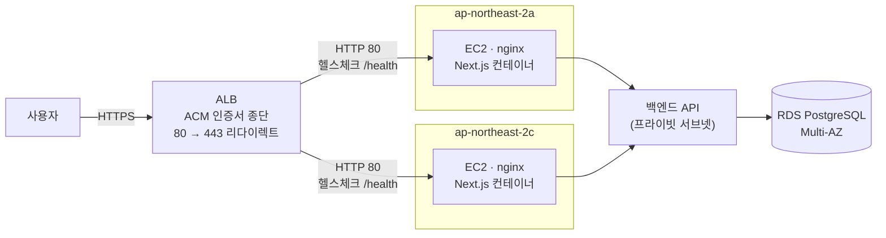
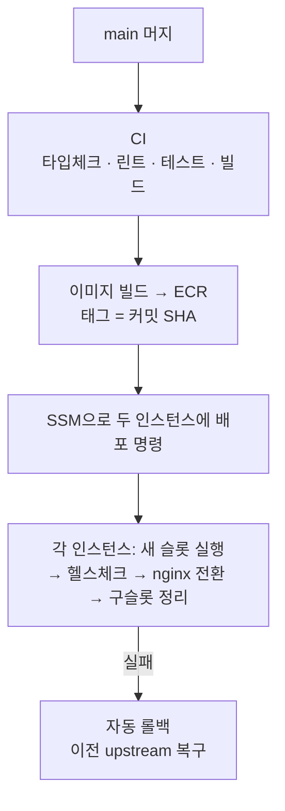

# BidFriend Frontend

회사 자격조건과 관심사를 바탕으로 나라장터 공고를 탐색·추천하는 BidFriend의 Next.js
프론트엔드입니다.

## 기술 스택

Next.js App Router · React · TypeScript · Tailwind CSS · AWS Cognito

인프라: ALB · EC2(2개 AZ) · Docker · ECR · GitHub Actions · AWS Systems Manager

## 아키텍처



- **SSL은 ALB에서 종단**합니다(ACM). nginx는 프록시와 이벤트 수집 레이트리밋만 담당합니다.
- 인스턴스는 **인터넷에서 직접 접근할 수 없습니다.** 보안그룹이 ALB 보안그룹으로부터의
  80번만 허용합니다.
- 브라우저는 Cognito ID 토큰을 같은 오리진 `/api/*`로 보내고, Next Route Handler가
  프라이빗 서브넷의 백엔드로 중계합니다. 백엔드는 외부에 노출되지 않습니다.

## 배포

`main` 브랜치에 머지되면 GitHub Actions가 자동 배포합니다.



인스턴스 안에서는 **컨테이너 단위 블루그린**으로 교체합니다.

1. 반대 슬롯(blue/green)에 새 컨테이너를 띄운다
2. `/health`와 **홈 화면 렌더**를 확인한다 — 프로세스 생존만으로 통과시키지 않습니다
3. 통과하면 nginx upstream을 새 슬롯으로 바꾸고 구 슬롯을 정리한다
4. 전환 후 헬스체크가 실패하면 이전 upstream으로 되돌린다

설계에서 신경 쓴 부분:

| | |
|---|---|
| **장기 액세스 키 없음** | GitHub Actions가 OIDC로 임시 자격증명을 받습니다 |
| **SSH 키·22번 포트 없음** | 배포는 AWS Systems Manager로 실행합니다 |
| **롤백 30초** | 별도 워크플로에서 커밋 SHA만 입력하면 빌드를 생략하고 ECR의 기존 이미지를 재배포합니다 |
| **이미지 태그 = 커밋 SHA** | `latest`를 쓰지 않아 두 인스턴스가 서로 다른 버전을 받는 일이 없습니다 |
| **런타임 주입 분리** | 백엔드 주소는 컨테이너 실행 시 주입해 이미지 재빌드 없이 교체됩니다. `NEXT_PUBLIC_*`는 빌드 시 번들에 포함되므로 공개 값만 넣습니다 |

관련 파일: [`deploy/blue-green-deploy.sh`](deploy/blue-green-deploy.sh) ·
[`deploy/nginx.conf`](deploy/nginx.conf) ·
[`.github/workflows/deploy.yml`](.github/workflows/deploy.yml) ·
[`.github/workflows/rollback.yml`](.github/workflows/rollback.yml)

## 로컬 개발 서버

필수 환경:

- Node.js 20 이상
- 함께 실행할 `bidmate-backend` API 서버

PowerShell 기준:

```powershell
# 최초 1회
npm install

# 환경변수 파일 준비
Copy-Item .env.example .env.local

# 개발 서버 실행
npm run dev
```

브라우저에서 [http://localhost:3000](http://localhost:3000)을 엽니다. 코드 변경은 자동으로
반영됩니다.

`.env.local`에서 로컬 백엔드를 사용하려면 다음처럼 설정합니다.

```dotenv
API_BASE_URL=http://localhost:8000
NEXT_PUBLIC_COGNITO_USER_POOL_ID=<Cognito User Pool ID>
NEXT_PUBLIC_COGNITO_CLIENT_ID=<Cognito App Client ID>
```

`API_BASE_URL`은 Next 서버만 읽는 값입니다. `NEXT_PUBLIC_*` 값은 브라우저 번들에
포함되므로 비밀번호나 비밀키를 넣지 마세요. 실제 값이 들어간 `.env.local`은 Git에
커밋하지 않습니다.

백엔드는 별도 터미널에서 실행합니다.

```powershell
Set-Location ..\bidmate-backend
.\.venv\Scripts\python.exe -m uvicorn app.main:app --reload --host 0.0.0.0 --port 8000
```

- 프론트: [http://localhost:3000](http://localhost:3000)
- 백엔드 상태: [http://localhost:8000/health](http://localhost:8000/health)
- 백엔드 Swagger: [http://localhost:8000/docs](http://localhost:8000/docs)

## 검사

CI가 돌리는 것과 같은 순서입니다.

```powershell
npx tsc --noEmit    # 타입체크
npm run lint
npm run test:ci     # vitest
npm run build
```

## 주요 디렉터리

```text
src/app/         App Router 페이지와 백엔드 프록시 Route Handler
src/components/  화면 컴포넌트
src/lib/api/     브라우저에서 호출하는 API 클라이언트
src/lib/         인증, 타입, 표시용 변환, 이벤트 수집
src/lib/data/    면허·인증·지역·직급 마스터 데이터
deploy/          블루그린 배포 스크립트와 nginx 설정
docs/            설계·운영 문서
```
